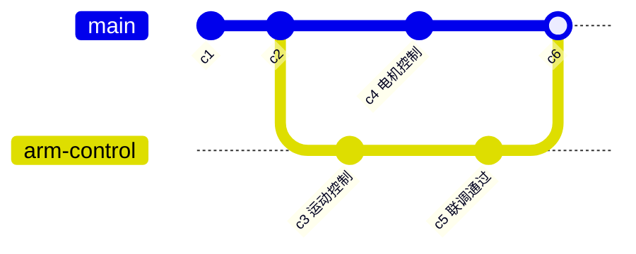
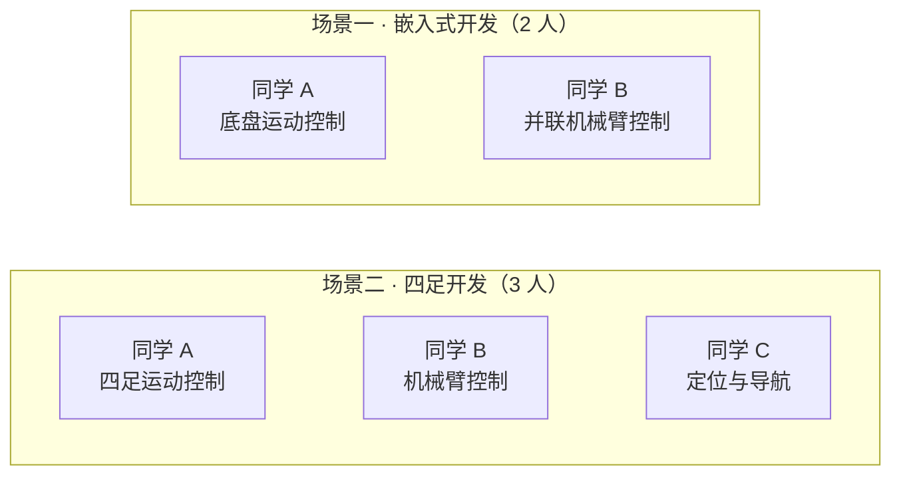
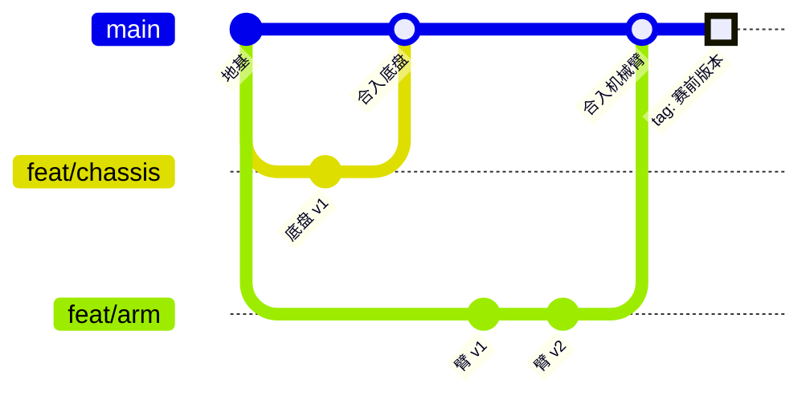
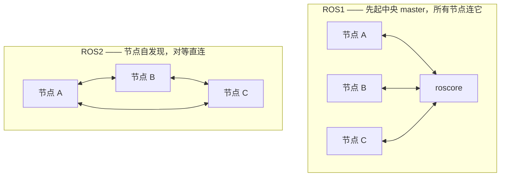
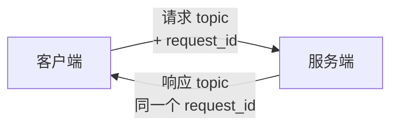
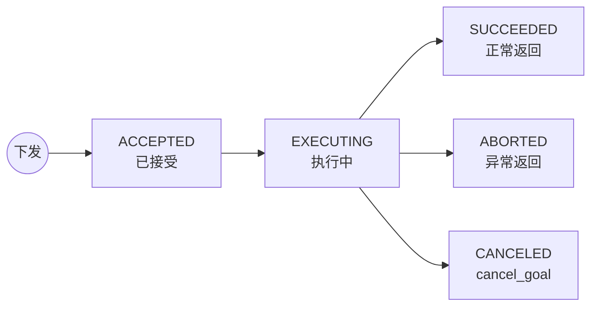
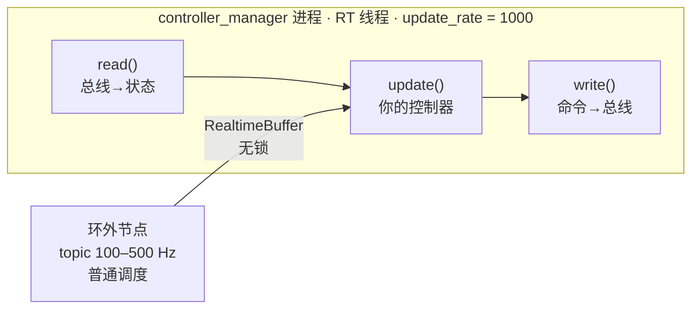
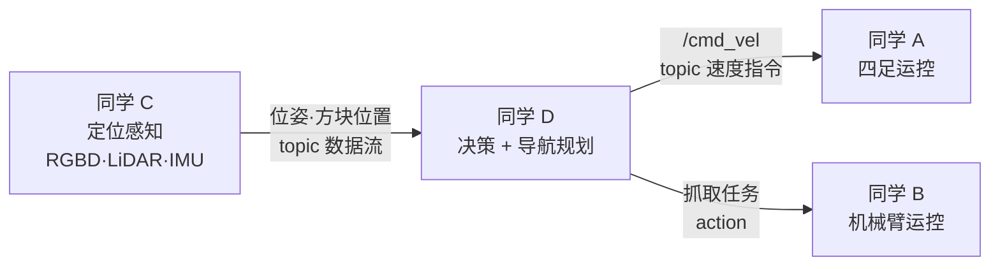

# 电控组培训第 7 讲

<div class="text-center text-3xl">

Git & ROS2 & Robot Arm Manipulation

</div>

<div class="abs-br m-6 text-sm text-right">
  <div>孙博奕 / 2026.9</div>
  <div>wechat: sby2272455958</div>
  <div>github: sunboy0303</div>
</div>

---

# A Note Before We Begin: My Advice on Using AI

<div class="mt-8 space-y-8">

<div>
<div class="text-2xl font-semibold">AI is still just a tool — it cannot solve every problem for you, especially those requiring physical interaction; its power depends not only on the model's capability, but even more on the person wielding it.</div>
<div class="mt-1 text-base font-medium text-primary">AI目前来看还只是一个工具，无法帮你解决所有需要和物理产生交互的问题，他的主要威力不仅取决于模型的能力更取决于使用它的人</div>
</div>

<div>
<div class="text-2xl font-semibold">You should always know what you are asking the AI to do and what it actually does; when the AI's actions exceed the boundaries of your own capabilities, it means you have lost control of the code.</div>
<div class="mt-1 text-base font-medium text-primary">你应该时刻知道你在让AI做什么，AI做了什么，当AI所做的事情超出你的能力边界，也就意味着你对这份代码失去了掌控</div>
</div>

</div>

<div class="mt-8 text-center text-2xl font-bold text-red-500">Always Maintain the Ability to Detect When AI is Deceiving You !!</div>


---

## Contents

<div class="grid grid-cols-2 gap-8">

<div>

- Git
  - Personal Repository Version Control
  - Branches & Merge
  - Daily Tips & .gitignore
  - Advanced Git: Hooks, CI & CD
  - Group Standard Develop WorkFlow
- ROS2
  - Why Develop Robots Should We Use ROS2
  - Topic: Publisher and Subscription
  - Service & Action: Client and Server
  - ROS2 Control
  - ROS2 Effective Develop of Team Collaboration

</div>

<div>

- Robot Arm Manipulation
  - Rotation Matrix & Orientation
  - Homogeneous Transformation
  - Forward & Inverse Kinematics
  - Jacobian Matrix
  - Dynamics & leg_control
  - Motion Planning & MoveIt2

</div>

</div>

---
layout: section
---

# Git

Distributed version control

---

## Personal Repository Version Control

<div class="mt-16 space-y-8 text-xl leading-loose tracking-wide">

设想一个我们用代码开发的实际场景，你在RC被安排和sby合作开发机械臂控制的项目，你负责做机械臂的运动控制，也就是告诉每一个电机你应该转到什么角度可以让我的机械臂的末端到达空间中的点(a, b, c)，然后sby负责去写电机控制，也就是把你得到的每一个电机的实际角度用对应电机厂家发给你的控制协议，变成电机读取的信息形式，让电机正确运动。

但是sby很笨，每次都只会发给你一个他开发好的zip压缩包，你每一次都要解压缩，然后把他各种各样的文件复制到你的项目中，才可以测试。

终于有一次，你好不容易在9.31基于sby 9.1号的代码实现了整个机械臂的运动控制，结果sby反手发给你了一个zip文件，名字叫 Version_0931.zip 你气愤地通宵把他新的代码和你的合并起来，colcon build 发现200个Error，你的天塌了...

</div>

---

## Why We Need Git

- **更新迭代频繁** — 每次保存都是一个新版本，`Version_0931.zip` 式命名很快就会失控
- **多人协作** — 你的代码建立在队友的代码之上，需要不断把对方的更新合并进自己的项目
- **多设备、跨平台** — 笔记本上开发，NX / STM32 上部署，代码需要在设备之间同步
- **海量小文本文件** — 两个版本之间往往只差几行，靠复制整个文件夹既看不清"改了什么"，也极易覆盖出错
- **需要随时回退** — 今天改崩了，必须能立刻回到昨天还能跑的版本

<v-click>

<div class="mt-8 text-center text-xl font-bold text-primary">
记录每一次改动 · 合并多人的工作 · 回到任意历史版本
</div>

</v-click>

---

## Git Basics: The Four Areas

<div class="flex justify-center">


</div>

- **工作区 Working Directory** — 你正在编辑的项目文件夹
  - <span class="text-red-500">`git status`</span> · `git diff` · `git restore <file>`
- **暂存区 Staging Area** — 待提交改动的"购物车"，先挑好这次要提交什么
  - <span class="text-red-500">`git add <file>`</span> · <span class="text-red-500">`git add .`</span> · `git restore --staged`
- **本地仓库 Local Repository** — 项目里的 `.git` 目录，把改动永久写入历史，全程不需要网络
  - <span class="text-red-500">`git commit -m "msg"`</span> · `git log --oneline` · `git reset --hard`
- **远程仓库 Remote Repository** — GitHub / Gitee / 自建 gitlab 等，团队共享的中枢
  - <span class="text-red-500">`git clone <url>`</span> · <span class="text-red-500">`git push`</span> · <span class="text-red-500">`git pull`</span> · <span class="text-red-500">`git fetch`</span>

<div class="text-sm opacity-70"><span class="text-red-500">红色命令</span> = 必须熟练掌握</div>


---

## Git Basics: Branches

**分支 Branch** — 指向某个 commit 的可移动指针，从它拉出一条**独立时间线**单独开发，互不干扰，做完再合回主线；主干随时保持可用

<div class="flex justify-center">



</div>

- <span class="text-red-500">`git branch`</span> · <span class="text-red-500">`git checkout -b <name>`</span> · <span class="text-red-500">`git checkout <name>`</span> · `git switch -c <name>` · `git switch <name>` · `git branch -d <name>`

---

## 分支的本质：哈希与指针

**上一页说"分支是指针"—— 指针是怎么实现的？答案：哈希（可以亲手打开看）**

<div class="text-base">

- 每个 commit 的 ID = 整个内容的 **SHA-1**：快照 + 父 commit 哈希 + 作者 + 时间 + 信息 → 40 位十六进制；内容改一个字节、哈希面目全非 —— <span class="text-red-500">防篡改是白送的</span>
- **分支就是一个文本文件**：`.git/refs/heads/arm-control` 里只有一行——某个 commit 的哈希；所谓"移动指针" = 往文件里写个新哈希
- **HEAD 也是一个文件**：`.git/HEAD` 写着 `ref: refs/heads/main`（"我现在站在哪条分支"）；commit 对象里存着**父 commit 的哈希** → 哈希串成链，`git log` 就是沿哈希链往回走

</div>

<div class="mt-3 px-3 py-2 border border-gray-500 border-opacity-40 rounded text-sm">

**打个比方**：哈希 = **指纹**（由内容天生决定，改一个字节就"换了个人"，谁也冒充不了）；commit 链 = **家谱**（每条记录都写着"我爸的指纹是…"，`git log` 就是顺藤摸瓜往上查）；分支 = **墙上的便利贴**（只写着"目前认准 c3a1f9…"，"移动分支" = 换一行字）—— 便利贴不值钱，所以建分支**瞬间完成、随便多建**

</div>

动手：`cat .git/HEAD` · `cat .git/refs/heads/*` —— 看完这两个文件，"指针"就再也不抽象了

---

## Git Basics: Merge & Conflicts

**合并 Merge** — <span class="text-red-500">`git merge <branch>`</span> 把另一条分支的改动并入当前分支

- 双方改的是**不同位置** → Git 自动合并
- 双方改了**同一处** → 产生**冲突 conflict**，Git 停下来等你裁决

```bash
<<<<<<< HEAD            # 你这边的版本
你的运动控制代码
=======                # 分隔线，两边只能留一个
sby 的电机控制代码
>>>>>>> motor-driver    # 对面的版本
```

**解决冲突**：`git status` 定位冲突文件 → 手动编辑取舍、删掉 `<<<` `===` `>>>` 标记 → `git add <file>` → `git commit`

<div class="text-sm opacity-80">

还没改完想放弃，`git merge --abort` 恢复到合并前；想看分支图，`git log --graph --oneline --all`

</div>

---

## Git Tips: Daily Rescue Kit

按**真实场景**记命令，比背参数有效得多：

- **改到一半，突然要切分支救人** — `git stash` · `git stash pop`
- **最后一条提交信息写错了** — `git commit --amend`
- **要撤销已经 push 的提交** — `git revert <commit>`，生成一条反向提交；公共历史不要用 `reset` 强改
- **只想要另一个分支的某一个 commit** — `git cherry-pick <commit>`
- **`reset --hard` 之后后悔了** — `git reflog` 记录着 HEAD 走过的每一步，找回 commit 号再 reset 回去
- **赛前锁定一个能跑的版本** — `git tag robocup-0930` · `git push --tags`，比赛现场随时 `git checkout` 回这个版本
- **这行坑爹代码是谁写的** — `git blame <file>`（标准用法：甩锅，以及找原作者问上下文）

---

## .gitignore & Big Files

**ROS2 项目第一天就该做的事** — colcon 的编译产物绝不进仓库：

<div class="must-master">

```bash
# .gitignore
build/
install/
log/
__pycache__/
*.pyc
.vscode/
```

</div>

<style>
.must-master pre, .must-master code, .must-master span {
  color: #ef4444 !important;
}
</style>

- 已经被 track 的文件，加进 `.gitignore` **不会**自动忽略，要先 `git rm -r --cached <dir>` 再提交
- 几十 MB 的大文件不要硬塞仓库，会拖慢所有人 clone —— 团队里常见的有：**onnx 模型**（训练好的神经网络权重，视觉检测用，动辄上百 MB）、**PCB 工程**（电路板设计文件，Altium / KiCad）、**CAD 模型**（机械件三维设计，SolidWorks 等）、视频 —— 用 **Git LFS**：`git lfs track "*.onnx"`

---

## Advanced Git: Hooks

**Git Hooks** — `.git/hooks/` 目录下的脚本，Git 会在特定动作的节点自动执行；脚本以非零退出码结束，该动作就被**阻断**

<div class="text-sm">

**为什么"非零退出码"能拦截？** —— Unix 老规矩：任何命令跑完都带回一个**退出码**——0 = 成功、非 0 = 失败（终端里 `echo $?` 能看到上一条的）；Git 跑完 hook 只看这个数字：<span class="text-red-500">0 → 放行，非 0 → 判定失败、立刻中止当前动作</span> —— 和你平时串命令 `cmd1 && cmd2`（前面成功才继续）是同一套机制；下面示例的 `|| exit 1` 就是把"编译失败"翻译成退出码 1 递给 Git

</div>

| Hook | 触发时机 | 组里能干什么 |
|---|---|---|
| `pre-commit` | commit 之前 | 跑 clang-format / lint，没格式化好就不许提交 |
| `commit-msg` | 写完提交信息后 | 检查提交信息是否符合组内规范（如 `feat: xxx`） |
| `pre-push` | push 之前 | 先 `colcon build` + 跑测试，编译不过就推不出去 |

```bash
# .git/hooks/pre-commit —— 记得 chmod +x 加上执行权限
colcon build --packages-select arm_control || exit 1
```

<div class="text-sm opacity-80">

注意：`.git/hooks/` 不会被提交到版本库 —— 想让全组统一配置，用 [pre-commit](https://pre-commit.com) 框架，把 `.pre-commit-config.yaml` 提交进仓库即可

</div>

---

## Advanced Git: Automated Tests & CI

- **单元测试** — gtest（C++）/ pytest（Python），ROS2 中 `colcon test` 一键运行所有包的测试
- **本地拦截** — `pre-push` hook：测试不过，代码就出不了你的电脑
- **远端拦截（CI）** — GitHub Actions：push / PR 自动触发构建 + 测试，红了就不许合并

```yaml
# .github/workflows/ci.yml
on: [push, pull_request]
jobs:
  build-and-test:
    runs-on: ubuntu-latest
    steps:
      - uses: actions/checkout@v4
      - run: colcon build
      - run: colcon test && colcon test-result --verbose
```


---

## CD: Continuous Delivery / Deployment

- **CI（上一页）** — push / PR 自动构建 + 测试，回答"这次改动能不能合"
- **CD（本页）** — 验证通过后把**交付**也自动化：打 tag 自动发版打包，不用任何人手动搬文件

```yaml
# .github/workflows/release.yml —— 打 tag 自动发 Release
on:
  push:
    tags: ["v*"]          # 只有推 v 开头的 tag 才触发
jobs:
  release:
    runs-on: ubuntu-latest
    steps:
      - uses: actions/checkout@v4
      - run: colcon build
      - run: tar czf arm-control-${{ github.ref_name }}.tar.gz install/
      - uses: softprops/action-gh-release@v2
        with:
          files: arm-control-*.tar.gz
```

- 比赛现场：`git checkout v1.0` 或直接下载 Release 附件 —— 彻底告别微信传 zip
- 进阶：CI 构建成 **Docker 镜像** 推到 registry，Orin NX / 服务器直接 `docker pull`

---

## Group Workflow: Two Typical Teams

3 人左右的小团队、模块边界清晰、每人 own 一个模块 —— 这是 RC 电控组最常见的两种形态：

<div class="flex justify-center">



</div>

**共同点**：人数少、每人负责一个独立模块、模块之间只靠**少量接口**通信 —— 这个特点直接决定了下面的仓库结构、分支策略和合并节奏

**但两种场景不能套同一套形态**：Git 层面的骨架（分支 / PR / CI / tag）完全通用；**仓库结构和接口形态**不同 —— 嵌入式没有 colcon 包和 topic，下面每一步都分 ROS2 与嵌入式两轨

---

## Group Workflow: Step 1 — 搭好地基

开工第一天，一人牵头把**基建**做进仓库，其他人 clone 即得同款环境。目录结构分两轨：

<div class="grid grid-cols-2 gap-2 text-xs compact-code">

```bash
# ROS2 场景 — colcon 工作区
robot_ws/
├── src/chassis_control/     # 同学 A 的包
├── src/arm_control/         # 同学 B 的包
├── src/robot_interfaces/    # 接口包（下一页）
├── src/bringup/             # 联调启动（共用）
├── .gitignore               # build/ install/ log/
└── .pre-commit-config.yaml  # 统一 hooks
```

```bash
# 嵌入式场景 — 裸机 / RTOS 工程
firmware/
├── bsp/ + drivers/      # 时钟/外设/电机驱动（共用，指定 owner）
├── chassis/             # 同学 A：底盘任务
├── arm/                 # 同学 B：机械臂任务
├── app/                 # RTOS 任务创建与调度
├── .gitignore           # build/ *.o *.axf Objects/ Listings/
└── .pre-commit-config.yaml
```

</div>

- **一人一个模块目录** —— 目录边界就是责任边界，从源头避免互相踩脚
- 配置全部**提交进仓库**：hooks 用 pre-commit 框架才会"跟人走"，新人 clone 完零配置直接干活
- **main 分支加保护**：不许直接 push，只能 PR 合入 —— 呼应上一节的 CI 红灯拦截

---

## Group Workflow: Step 2 — 先定接口，再各自开发

模块交界处是队友之间**唯一的耦合点**，开工前必须先商量好：**我该如何调用你的部分？** 两种场景接口形态不同，原则相同：

**ROS2 场景** — 接口 = topic / service / action，统一放进 `robot_interfaces` 包：

```yaml
# 例：四足场景的交界
/cmd_vel            # 导航(C) → 四足运动控制(A)：速度指令
/arm/set_end_pose   # 上层 → 机械臂控制(B)：service，设定末端位姿
```

**嵌入式场景** — 接口 = 头文件 API + 消息队列，外加一张**硬件资源划分表**：

```c
// chassis.h —— 底盘模块对外只暴露这一个头文件
void chassis_set_velocity(float vx, float vy, float wz);
bool chassis_get_odom(odom_t *odom);
```

- 嵌入式的**资源划分表**写进 README：CAN1→底盘、CAN2→机械臂、SPI3→IMU、任务周期与优先级 —— RTOS 任务共享中断和外设，这张表就是模块边界
- 开发期先给 **stub**：ROS2 发假 topic，嵌入式返回假 odom —— 队友进度互不阻塞

---

## Group Workflow: Step 3 — 日常循环与合入

**每人一条 feature 分支，小步快合，main 永远保持能跑：**

<div class="flex justify-center">



</div>

- 分支命名 `feat/chassis-xxx`、`feat/arm-xxx` —— 一眼可读
- **每天开工先 `git pull` 同步 main**；功能一完成立刻合回去 —— 拖两周再合并，冲突就是灾难
- 合并走 **PR**：CI 全绿 + 负责整车项管队友 review，才允许合入 main
- 直接在main代码上做的修改要在 main 上打 tag，联调出问题随时整体回退

---

## Group Workflow: 嵌入式的深坑

RTOS 工程的模块边界比 ROS2 **模糊得多** —— 任务共享中断、外设、内存，冲突面更大，规范要沿开发链路一环环定死：**统一环境 → 防代码冲突 → 严管底层 → 把住合入 → 发布可查**

- **编译器版本全组统一** — `arm-none-eabi-gcc` 的版本号写进 README、配一键安装脚本；版本不一致就是同一份代码两个结果，"我这能编译你那报错"的玄学问题永远查不完
- **生成代码是冲突重灾区** — CubeMX 的 `.ioc` 和 `main.c` 谁重新生成一次就全变：外设分配定好后**不许各自 regenerate**，手写代码只放 `/* USER CODE */` 区块
- **底层一动全身** — `bsp/` `drivers/` 是公共地板：改这里必须走 PR + 另一人 review；现场出问题第一反应 `git log bsp/` 看最近改动
- **任何人的 PC 都要能过完整编译** — 这是合入 main 的底线，编不过的代码不许 push；CI 替你把这道关：Actions 里装同版本工具链交叉编译，逻辑测试把寄存器 mock 掉跑在 PC 上（Unity / CMock）
- **固件版本一致且永远可查** — tag → CI 自动把 `.hex` / `.bin` 附到 Release，每台车刷的哪个 tag 一查便知；赛前所有车统一刷到同一个 tag
- **用markdown写文件比用word惬意多了^_^**
---
layout: section
---

# ROS2

The standard framework for robot development: communication, building tool and ecosystem out of the box.

---

## Why Develop Robots Should We Use ROS2

**任何一个智能机器人，都由同样的五层构成：感知 → 决策 → 规划 → 控制 → 执行**

<div class="text-xs">

以 RoboCon 四足机器人搬运方块为例 —— 每一层在这个任务里分别是什么：

| 层 | 回答的问题 | 这个任务里是什么 |
|---|---|---|
| **感知** Perception | 环境和自身现在什么状态？ | RGBD 相机找方块位置；LiDAR + IMU 定机器人位姿 |
| **决策** Decision | 现在该做什么？ | 任务状态机：移动到抓取点 → 抓取 → 搬运 → 放置 |
| **规划** Planning | 具体怎么做？ | 全局路径规划器（怎么走到方块旁）；机械臂运动规划器（怎么动到方块） |
| **控制** Control | 怎么实时稳定地跟踪？ | 四足步态 / 平衡控制器；机械臂关节伺服 |
| **执行** Execution | 真正做功的硬件 | 机械臂 + 四足的所有关节电机 |

</div>

<div class="text-sm">

**这么多模块是怎么一起跑起来的？—— 多进程**：每一个部分都是一个独立进程，单独处理自己的信息、再互相通信交换 —— 这个框架、这个交换信息的平台，就是 **ROS2**。

</div>

<v-click>

<div class="mt-2 text-center text-lg font-bold text-red-500">ROS2 不是多么神奇的东西 —— 核心只是一个通信的媒介</div>

<div class="mt-2 text-center text-xs font-medium text-primary">但生态早已长全：colcon · tf2 · RViz · rosbag · launch · ros2_control · MoveIt —— 不再只是一个多进程通信工具</div>

</v-click>

---

## What Changed: ROS1 → ROS2

**最大的变化：不再需要 roscore 了**

<div class="flex justify-center">



</div>

<div class="text-base">

- ROS1 的 master 一挂全系统瘫痪；ROS2 节点**自发现**直接对话 —— **没有单点故障**
- 其余大致差异：**QoS** 可按话题定制；**micro-ROS** 能直接跑在 MCU 上

</div>

<div class="mt-3 text-center text-xl font-bold text-red-500">ROS1 已逐渐淘汰 —— 只需要学习 ROS2 即可</div>

---

## Topic: Publisher and Subscription

**场景接第 1 页**：规划层把速度指令**单向持续**发给四足运动控制器 —— 这就是 Topic

<div class="grid grid-cols-2 gap-2 compact-code">

```python
# 发布者 —— 规划节点
import rclpy
from geometry_msgs.msg import Twist
rclpy.init()
node = rclpy.create_node('planner')
pub = node.create_publisher(Twist, '/cmd_vel', 10)
def tick():               # 10 Hz 持续发布
    msg = Twist()
    msg.linear.x = 0.5    # 前进 0.5 m/s
    pub.publish(msg)
node.create_timer(0.1, tick)
rclpy.spin(node)          # 持续运行
```

```python
# 订阅者 —— 四足控制节点
import rclpy
from geometry_msgs.msg import Twist
def on_cmd(msg):          # 收到消息，自动回调
    print(f'vx = {msg.linear.x}')
rclpy.init()
node = rclpy.create_node('locomotion')
node.create_subscription(Twist, '/cmd_vel', on_cmd, 10)
rclpy.spin(node)          # spin：分发回调
```

</div>

<div class="text-base">

**实现一次 Topic 通信，代码里数出四样东西**：

- **消息类型** `Twist` —— 数据格式的<span class="text-red-500">合同</span>，两端同一个类型
- **话题名** `/cmd_vel` —— 命名的<span class="text-red-500">频道</span>，两端对上才能收到
- **QoS** `10` —— 通信策略的"历史深度"：只缓存最近 10 条，入门照抄（QoS 是什么？见后面的"寄快递"页）
- **回调 + `spin()`** —— 消息到达进队列，spin 取出<span class="text-red-500">自动触发回调</span>

</div>

---

## Topic: 背后机制

<div class="mt-2 space-y-4 text-lg leading-normal">

<div>

**① 命名的广播电台** —— 发布者只管发，<span class="text-red-500">不知道谁在听</span>；订阅者只管收，<span class="text-red-500">不知道谁在发</span>，两端彻底解耦：一边崩了另一边照常跑

</div>

<div>

**② 怎么找到彼此 —— DDS 两步自发现（没有中心）**：每个节点进程是一个 DDS Participant，启动后先<span class="text-red-500">组播自介绍</span>互相认识，再交换各自有哪些 writer / reader；<span class="text-red-500">topic + 类型 + QoS</span> 都匹配的自动配对，从此点对点直连 —— 这就是不再需要 roscore 的底层

</div>

<div>

**③ 消息怎么到 —— 一条 DDS 管道**：

<div class="flex justify-center">


</div>

队列的长度与可靠性，就是 **QoS 生效的地方**（`10` = 最多缓存 10 条）

</div>

<div>

**④ 术语对应** —— `create_publisher` → DataWriter · `create_subscription` → DataReader · `ROS_DOMAIN_ID` → 隔离的域（域不同，互相看不见）

</div>

</div>

<div class="mt-4 text-base">调试三连：<span class="text-red-500 font-bold">`ros2 topic list`</span> · <span class="text-red-500 font-bold">`ros2 topic echo /cmd_vel`</span> · `ros2 topic hz /cmd_vel`</div>

<div class="mt-2 text-xs opacity-60">真实工程里节点通常写成 class 继承 Node —— 上一页取最简写法，聚焦通信 API</div>

---

## 管道与 QoS：像寄一份快递

**上一页 DDS 管道的每个环节，都能在快递里找到对应**

<div class="text-xs">

| DDS 环节 | 快递比喻 | 到底在干什么 |
|---|---|---|
| **序列化 CDR** | 按统一装箱单打包 | 结构体 → 标准字节流，收件方按同一张单子拆箱还原 |
| **DataWriter 队列** | 发件仓库的货架 | 发出前排队，货架容量 = KEEP_LAST N |
| UDP / 共享内存 | 快递车 / 共墙传物口 | UDP 走网络协议栈（跨进程）；共享内存 = 同机共用一块内存，免搬运 |
| **DataReader 队列** | 收件仓库的货架 | 到货排队，等你来取 |
| spin + 回调 | 管家定期取件、拆箱送到手上 | spin 循环从货架取货，触发你的回调 |

</div>

<div class="text-sm">

**QoS（通信策略）= 寄快递时选的服务档次**：

- **可靠性**：RELIABLE = <span class="text-red-500">挂号信</span>（必达、丢了补发）· BEST_EFFORT = <span class="text-red-500">平信</span>（快、可丢）—— 图像/指令常选平信：要最新不要旧帧
- **历史深度 KEEP_LAST(N)**：货架只留最新 N 件 —— 代码里的 `10` 就是它；要"永远最新"用 depth 1
- **匹配提醒**：发方平信 + 收方挂号信 = 不兼容，<span class="text-red-500">一条也收不到还不报错</span>

</div>

---

## Service: Client and Server

**接场景**：上层要机械臂运动到抓取位姿 —— 必须**等到确认结果**才能走下一步，这种"一问一答"就是 Service

<div class="grid grid-cols-2 gap-2 compact-code">

```python
# 服务端 —— 机械臂控制节点
import rclpy
from robot_interfaces.srv import SetEndPose
def handle(req, res):    # 收到请求
    res.success = move_to(req.pose)
    return res           # 必须返回响应
rclpy.init()
node = rclpy.create_node('arm_control')
node.create_service(SetEndPose, 'set_end_pose', handle)
rclpy.spin(node)
```

```python
# 客户端 —— 上层任务节点
import rclpy
from robot_interfaces.srv import SetEndPose
rclpy.init()
node = rclpy.create_node('task_node')
cli = node.create_client(SetEndPose, 'set_end_pose')
cli.wait_for_service()                # 等对方在线
fut = cli.call_async(
    SetEndPose.Request(pose=target))  # 发出请求
rclpy.spin_until_future_complete(node, fut)
print('到位了吗:', fut.result().success)
```

</div>

**实现一次 Service 通信，需要四样东西**：

- **服务类型** `SetEndPose.srv` —— `---` <span class="text-red-500">上请求、下响应</span>；自定义接口放 `robot_interfaces` 包
- **服务名** `set_end_pose` —— 两端对上同一个名字
- **服务端** `create_service(类型, 名, 回调)` —— 回调收 `req`，处理完<span class="text-red-500">必须返回</span> `res`
- **客户端** `create_client` + `call_async` —— 拿 future，`spin_until_future_complete` 等结果

---

## Service: 背后机制

<div class="mt-2 space-y-4 text-lg leading-normal">

<div>

**① 远程函数调用** —— 客户端"调用"，服务端"执行并返回"，<span class="text-red-500">一问必有一答</span>：调用方拿到确认才继续

</div>

<div>

**② 底层拆开 —— 一对 topic + 请求 ID 配对**：

<div class="flex justify-center">



</div>

客户端发出请求时记下 id、拿一个 future 挂起等待；响应带着<span class="text-red-500">同一个 request_id</span> 回来，配对成功才填充 future —— `call_async` 返回的 future 就是这么实现的

</div>

<div>

**③ 服务强制可靠传输** —— 请求、响应一条都不能丢，所以默认 <span class="text-red-500">RELIABLE</span> QoS；topic 才允许选"丢了也行"的 best-effort

</div>

<div>

**④ 单线程回调** —— 默认一次只处理一个请求：回调里干长活会<span class="text-red-500">堵死整个服务</span>，这正是 Action 存在的理由（后面两页）

</div>

</div>

<div class="mt-4 text-base">调试：<span class="text-red-500 font-bold">`ros2 service list`</span> · `ros2 service call /set_end_pose robot_interfaces/srv/SetEndPose "..."`</div>

---

## Action: Client and Server

**接场景**：决策层下发"导航到方块旁" —— **耗时长 · 要进度 · 可取消**

<div class="grid grid-cols-2 gap-2 compact-code compact-code-xs">

```python
# 动作端 —— 导航节点
import rclpy
from rclpy.action import ActionServer
from robot_interfaces.action import GoToPose
def execute(goal):               # 长任务写这里
    for i, step in enumerate(PATH):
        move(step)
        goal.publish_feedback(   # 持续汇报进度
            GoToPose.Feedback(progress=i / len(PATH)))
    return GoToPose.Result(success=True)
rclpy.init()
node = rclpy.create_node('navigator')
ActionServer(node, GoToPose, 'go_to_pose', execute_callback=execute)
rclpy.spin(node)
```

```python
# 客户端 —— 决策节点
import rclpy
from rclpy.action import ActionClient
from robot_interfaces.action import GoToPose
rclpy.init()
node = rclpy.create_node('task_node')
cli = ActionClient(node, GoToPose, 'go_to_pose')
cli.wait_for_server()
fut = cli.send_goal_async(
    GoToPose.Goal(target=goal_pose))  # 下发目标
rclpy.spin_until_future_complete(node, fut)
handle = fut.result()      # 任务凭据，不是结果
r = handle.get_result_async()
rclpy.spin_until_future_complete(node, r)
```

</div>

<div class="compact-code compact-code-xs">

```python
# robot_interfaces/action/GoToPose.action —— 两根 --- 切成三段
geometry_msgs/PoseStamped target      # ① goal：去哪（随任务下发）
---
bool success                          # ② result：最终到了吗（结束才有，可带说明字段）
---
float32 progress                      # ③ feedback：进度 0~1（执行中持续汇报）
```

</div>

- **长任务写在 `execute_callback`**，随时 `publish_feedback`；客户端拿到的 **goal handle = 任务凭据不是结果**，可 `cancel_goal()` 取消

---

## Action: 背后机制 Ⅰ —— 五条通道

**一个 Action = 3 个 service + 2 个 topic，拼出"长任务协议"**：

<div class="text-sm">

| 通道 | 类型 | 方向 | 干什么 |
|---|---|---|---|
| goal | service | 客户端 → 服务端 | <span class="text-red-500">下发目标</span>，返回接受 / 拒绝 |
| cancel | service | 客户端 → 服务端 | 中途放弃 |
| result | service | 客户端 → 服务端 | 任务结束后<span class="text-red-500">取最终结果</span> |
| feedback | topic | 服务端 → 客户端 | 执行中<span class="text-red-500">持续汇报进度</span> |
| status | topic | 服务端 → 广播 | 所有目标的状态，RViz / 监控节点都能听 |

</div>

<div class="flex justify-center">


</div>

**为什么这么拆** —— 目标要确认收到 → service；进度是连续流 → topic；结果任务结束才有 → get_result 等待

---

## Action: 背后机制 Ⅱ —— 状态机与选型

**goal handle 状态机**（客户端拿到的"任务凭据"就是它；状态变化广播在 **status topic**，服务端可同时挂多个 goal）：

<div class="flex justify-center">



</div>

<div class="text-xs">

| | Topic | Service | Action |
|---|---|---|---|
| 模式 | 广播 | 一问一答 | 下发长任务 |
| 数据 | 单向连续流 | 请求 + 响应 | 目标 + 反馈 + 结果 |
| 典型 | `/cmd_vel`、传感器 | 设定位姿、标定 | 导航、抓取 |

</div>

<div class="mt-2 text-center text-base font-bold text-red-500">选用口诀：连续流用 Topic · 短确认用 Service · 长任务用 Action</div>

<div class="text-xs opacity-70">调试：`ros2 action list` · `ros2 action info /go_to_pose`</div>

---

## DDS 实现与选型

**DDS 只是标准（OMG）—— ROS2 靠 RMW 抽象层适配各种实现**，换 DDS 零代码改动，一个环境变量搞定：`export RMW_IMPLEMENTATION=rmw_cyclonedds_cpp`

<div class="text-sm">

| 实现 | 出品方 | 特点 | 谁的默认 |
|---|---|---|---|
| Fast DDS | eProsima | 功能全，同机默认走共享内存 | Humble 及更早 |
| Cyclone DDS | Eclipse / ZettaScale | 轻量、延迟好、一个 XML 配完 | Iron / Jazzy |
| RTI Connext | RTI | 工业级认证，商用收费 | 手动装 |
| Zenoh | ZettaScale | 新一代协议（不是 DDS），弱网友好 | 实验性 |

</div>

- **别纠结选型，纠结统一** —— 用发行版默认（Humble → Fast DDS，Jazzy → Cyclone），<span class="text-red-500">全组写死同一个</span>进 README；RMW 混用 = "我这能跑你那不行"的玄学之源
- **常见坑：组播被禁** —— 自发现靠组播，场馆 / 校园网常把它关掉 → 节点互相看不见，用 XML 配单播 peer 列表即可
- **性能问题以后再说** —— 相机大流量走共享内存、调 socket buffer，大多数队到不了这一步

---

## Topic 速算例题：四足 12-DoF 运控指令流

<div class="text-base">

**设定**：12 关节 × (force / pos / vel / kp / kd，float32)，500 Hz – 1 kHz，UDP 本机，QoS depth = 10 —— **L** = 12 × 5 × 4 B + 前缀 ≈ **0.26 KB**/条

| 检查项 | 计算 | 结论 |
|---|---|---|
| 带宽 L×f | 130–260 KB/s | 环回能力（~GB/s）的 **0.1%**，不会排队 |
| 延迟 ≈ L/B_eff + C_fixed | 0.5 μs + 固定开销 → C++：**0.1–0.3 ms**；Python：**0.5–1+ ms** | <span class="text-red-500">与长度无关，全看节点实现</span> |
| QoS=10 的含义 | 积压上限 = 10 × (1/f) = **10–20 ms 旧指令** | 指令流用 <span class="text-red-500">depth = 1</span>：跳到最新 |

- **结论一**：1 kHz 周期才 1 ms，Python 端通信开销就吃掉大半周期 → <span class="text-red-500">运控节点必须 C++</span>
- **结论二**：敌人是**抖动**不是均值 —— 调度 / 抢核 / GC 让某几拍飙几 ms → 绑核 + `SCHED_FIFO`

</div>

---

## 为什么 kHz 运控环不走 Topic

**根本原因：Topic 给的是"平均快"，运控要的是<span class="text-red-500">每一拍都准</span>**

- **回调调度不确定** —— executor 唤醒走普通内核调度，最坏情况几 ms；控制环要确定性的最坏响应时间，低均值没有意义
- **热路径有动态内存和拷贝** —— publish → 序列化 → 队列，分配与页错误随时引入毛刺，无法给出硬上界
- **语义错配：事件 vs 采样** —— 控制环要"每拍开始时读一次最新值"（采样），topic 是"来了就回调"（事件）；kHz 下回调风暴本身就把 spin 线程打满
- **进程边界** —— 跨进程 = 上下文切换 + 多次拷贝，实时环天生要收进单进程单线程

**真实四足栈的做法**：kHz 运控环（状态估计 + WBC + 总线收发）收进<span class="text-red-500">单进程固定时序循环</span>，直接怼 EtherCAT / CAN；ROS2 topic 只出现在<span class="text-red-500">环外</span> —— 决策 / 步态规划以 100–500 Hz 把目标喂给运控，这个频率 topic 完全胜任

<div class="mt-4 text-center text-lg font-bold text-primary">这正是下一节 ros2_control 存在的理由：它把 read() → update() → write() 的固定时序实时环封装好，替你守住实时 / 非实时的边界</div>

---

## ROS2 Control: 为什么频率稳

**根本原因只有两条 —— <span class="text-red-500">内核级 RT 线程</span> + <span class="text-red-500">绕开 DDS 的进程内共享内存</span>**

<div class="text-base">

- **① 内核级 RT 线程** —— `SCHED_FIFO` 是内核调度策略：实时线程**无条件抢占**一切普通线程，update() 每 1 ms 被**内核**准时叫醒 —— "到点必达"，不是"尽量快"
- **② 通信绕开 DDS，直接共享内存** —— 控制器与硬件抽象同进程，command / state interface 就是一块 `double` 数组：<span class="text-red-500">零序列化 · 零拷贝 · 零队列 · 零网络栈</span>，例题里的 C_fixed 压到 ≈ 0
- **其余都是配套** —— 固定周期定时器定节拍；环外 topic 经 RealtimeBuffer 无锁进环；热路径零分配零日志

</div>

<div class="flex justify-center">



</div>

<div class="text-center text-base font-bold text-primary">环内 = 内核级 RT 调度 + 进程内共享内存 —— "每一拍都准"的来源</div>

---

## ROS2 Control: 写一个自己的控制器

**一个控制器 = 实现三个函数**：认领接口（要什么）· on_activate（备资源）· update（每拍干什么）

<div class="compact-code">

```cpp
class LegController : public controller_interface::ControllerInterface {
  // ① 认领接口：声明用哪些命令/状态，形如 "knee_fr/effort"
  InterfaceConfiguration command_interface_configuration() const override;
  // ② 环外数据入口：topic 回调跑在普通线程，经无锁缓冲进环
  void on_activate(const State&) override {
    sub_ = get_node()->create_subscription<LegCmd>(
        "/leg_cmd", 10,
        [this](auto m) { buf_.writeFromNonRT(*m); });
  }
  // ③ 每拍被调（Humble 叫 update，Iron+ 改名 on_update）
  ReturnType update(const Time&, const Duration&) override {
    auto cmd = *buf_.readFromRT();                  // 无锁取最新指令
    double q = state_interfaces_[0].get_value();    // 读：进程内数组
    double tau = cmd.kp * (cmd.q_des - q)
               - cmd.kd * qd_est;                   // 算：PD
    command_interfaces_[0].set_value(tau);          // 写：进程内数组
    return OK;
  }
};
```

</div>

<div class="text-base">

- **接口名（`joint/interface`）= 控制器与硬件的<span class="text-red-500">契约</span>** —— hardware_interface 负责对接 EtherCAT / CAN / 仿真器
- update() 只做 读 → 算 → 写；<span class="text-red-500">禁止</span> new / 日志 / sleep / 锁 —— pluginlib 导出成插件，YAML 一行注册（下页）

</div>

---

## ROS2 Control: 把环跑起来

**频率、插件、硬件，三样各在哪定义**：

```yaml
# my_robot.ros2_control.yaml
controller_manager:
  ros__parameters:
    update_rate: 1000        # ← 环的频率，这一行定死
    joint_state_broadcaster:
      type: joint_state_broadcaster/JointStateBroadcaster
    leg_controller:
      type: leg_controllers/LegController    # 你写的插件
```

**C++ 和 YAML 是怎么接上头的？—— 一个控制器的三段旅程**

<div class="text-sm">

- **① 编译** —— `.cpp` → 机器码 → `.so` 动态库；YAML 只是 `config/` 纯文本，<span class="text-red-500">编译器根本不看它</span>
- **② 启动** —— `controller_manager` 读 YAML：`update_rate: 1000` → 开 1ms 定时器；`type: leg_controllers/LegController` → <span class="text-red-500">按名字加载 .so</span>（pluginlib），调 `on_activate()`（建无锁缓冲和订阅）
- **③ 运行** —— 每 1ms 调一次 `update()`（PD）；YAML 已读完、<span class="text-red-500">不再参与计算</span>（除非动态改参数）
- **URDF 声明硬件层** —— `<ros2_control>` 标签写 hardware plugin 与各 joint 的 interface 名单；spawner 激活 joint_state_broadcaster（`/joint_states`，环内→环外的桥）；现成轮子：forward_command_controller、fake_components

</div>

调试：<span class="text-red-500">`ros2 control list_controllers`</span> · `ros2 control list_hardware_interfaces`

---

## ROS2 Team Collaboration: 四人协同一台自主四足

<div class="text-base">

**场景**：A 四足运控 · B 机械臂运控 · C 定位感知 · D 决策+导航规划 —— 落回第 1 页的五层架构（C=感知，D=决策规划，A/B=控制，电机=执行）

</div>

<div class="flex justify-center">



</div>

**开工第一件事：按链路特性选通信 —— 频率多高？容忍多大延迟？同步还是异步？**

<div class="text-xs">

| 链路 | 特性 | 选型 |
|---|---|---|
| C → D 位姿 / 目标 | 连续流、可丢帧 | topic（best_effort） |
| D → A `/cmd_vel` | 连续流、只要最新 | topic（depth = 1） |
| D → B 抓取 | 长任务、要进度、可取消 | action |
| A / B 内部 1 kHz 运控环 | 硬实时、每拍都准 | <span class="text-red-500">不走通信 —— ros2_control</span> |

</div>

---

## ROS2 Team Collaboration: 接口先行 · 并行开发 · merge 联调

<div class="text-base">

- **Step 1 · 接口先行** —— 第一天把 msg / srv / action 全定进 `robot_interfaces` 包：谁用什么数据、什么频率、什么 QoS，写进 README；<span class="text-red-500">改接口必须走 PR</span>（就是 Git 部分说的那个接口包）
- **Step 2 · 并行开发** —— 一人一个 package（目录结构 Git 部分讲过），都从 `robot_interfaces` import 同一套接口；进度互不阻塞靠 **stub**：感知没好？决策先订假位姿；运控没好？假 `/cmd_vel` 照样调
- **Step 3 · merge 联调** —— feat 分支 + PR + CI（`colcon build && colcon test`）全绿才合 main；联调用 `bringup` 包的 launch <span class="text-red-500">一条命令拉起全车四个人的节点</span>

</div>

**联调三大经典锅**：

- **接口私改没走 PR** —— 一人改字段，三人编译爆炸
- **单位不统一** —— rad vs deg、m vs mm，机器人当场抽风
- **QoS 不匹配** —— pub 是 best_effort 而 sub 要 reliable = <span class="text-red-500">数据永远到不了</span>，且不报错；`ros2 topic info -v` 一查便知

<div class="text-center text-base font-bold text-primary">Git 管协作流程，ROS2 管通信契约 —— 两套规范合起来，就是团队的"开发法"</div>

---
layout: section
---

# Robot Arm Manipulation

from rotation matrices to planning & control.

---

## Rotation Matrix: 从一个 2D 向量开始

<div class="grid grid-cols-2 gap-4 items-center">

<div>

<svg viewBox="0 0 480 300" class="w-full">
  <defs>
    <marker id="arr" viewBox="0 0 10 10" refX="9" refY="5" markerWidth="7" markerHeight="7" orient="auto-start-reverse"><path d="M0,0 L10,5 L0,10 z" fill="#94a3b8"/></marker>
    <marker id="arrB" viewBox="0 0 10 10" refX="9" refY="5" markerWidth="7" markerHeight="7" orient="auto-start-reverse"><path d="M0,0 L10,5 L0,10 z" fill="#3b82f6"/></marker>
    <marker id="arrR" viewBox="0 0 10 10" refX="9" refY="5" markerWidth="7" markerHeight="7" orient="auto-start-reverse"><path d="M0,0 L10,5 L0,10 z" fill="#ef4444"/></marker>
  </defs>
  <line x1="90" y1="260" x2="455" y2="260" stroke="#94a3b8" stroke-width="1.5" marker-end="url(#arr)"/>
  <line x1="90" y1="260" x2="90" y2="30" stroke="#94a3b8" stroke-width="1.5" marker-end="url(#arr)"/>
  <text x="462" y="265" fill="#64748b" font-size="12">x</text>
  <text x="80" y="26" fill="#64748b" font-size="12">y</text>
  <line x1="253" y1="184" x2="253" y2="260" stroke="#cbd5e1" stroke-dasharray="4 4"/>
  <line x1="253" y1="184" x2="90" y2="184" stroke="#cbd5e1" stroke-dasharray="4 4"/>
  <line x1="90" y1="260" x2="253" y2="184" stroke="#3b82f6" stroke-width="3" marker-end="url(#arrB)"/>
  <line x1="90" y1="260" x2="166" y2="97" stroke="#ef4444" stroke-width="3" marker-end="url(#arrR)"/>
  <path d="M 153.4 230.4 A 70 70 0 0 0 119.6 196.6" fill="none" stroke="#f59e0b" stroke-width="2"/>
  <text x="160" y="212" fill="#f59e0b" font-size="14" font-weight="bold">θ</text>
  <text x="172" y="250" fill="#3b82f6" font-size="12">α</text>
  <circle cx="253" cy="184" r="3.5" fill="#3b82f6"/>
  <circle cx="166" cy="97" r="3.5" fill="#ef4444"/>
  <text x="262" y="182" fill="#3b82f6" font-size="13" font-weight="bold">p = (x, y)</text>
  <text x="118" y="88" fill="#ef4444" font-size="13" font-weight="bold">p′ = R·p</text>
  <text x="230" y="278" fill="#94a3b8" font-size="11">x = r·cosα</text>
  <text x="14" y="180" fill="#94a3b8" font-size="11">r·sinα</text>
</svg>

</div>

<div class="text-sm">

**向量 p 转过 θ 后到哪？—— 和角公式直接给出答案**

- 转之前：$p = (r\cos\alpha,\ r\sin\alpha)$；转之后角度变成 $\alpha + \theta$：

$$x' = r\cos(\alpha{+}\theta) = \cos\theta \cdot x - \sin\theta \cdot y$$

$$y' = r\sin(\alpha{+}\theta) = \sin\theta \cdot x + \cos\theta \cdot y$$

- 写成矩阵 —— $R(\theta)$ 从三角恒等式里"掉"了出来：

$$\begin{bmatrix} x' \\ y' \end{bmatrix} = \begin{bmatrix} \cos\theta & -\sin\theta \\ \sin\theta & \cos\theta \end{bmatrix} \begin{bmatrix} x \\ y \end{bmatrix}$$

</div>

</div>

<div class="text-base">

**列向量约定下，乘法顺序怎么读？** —— p′ = R·p，矩阵左乘列向量；连续"先 $R_1$ 后 $R_2$"：$p' = R_2(R_1\,p)$ —— <span class="text-red-500">从右往左读，像嵌套函数 f(g(x))：最右边的最先作用</span>；行向量约定（部分图形学教材）则整体反过来（p′ = p·R₁·R₂）—— 机器人学统一列向量，所以一律从右往左

</div>

---

## Rotation Matrix: 三维 —— 绕轴旋转

**三维 = 绕一根轴转：被绕的轴不动（对角线放 1），剩下的 2×2 块就是上一页的 2D 旋转**（下式 $c\theta = \cos\theta$，$s\theta = \sin\theta$）

<div class="grid grid-cols-3 gap-2">

<div>

<svg viewBox="0 0 160 168" class="w-[190px] mx-auto">
  <defs>
    <marker id="axg" viewBox="0 0 10 10" refX="9" refY="5" markerWidth="6" markerHeight="6" orient="auto-start-reverse"><path d="M0,0 L10,5 L0,10 z" fill="#94a3b8"/></marker>
    <marker id="axo" viewBox="0 0 10 10" refX="9" refY="5" markerWidth="6" markerHeight="6" orient="auto-start-reverse"><path d="M0,0 L10,5 L0,10 z" fill="#f59e0b"/></marker>
    <marker id="axr" viewBox="0 0 10 10" refX="9" refY="5" markerWidth="6" markerHeight="6" orient="auto-start-reverse"><path d="M0,0 L10,5 L0,10 z" fill="#ef4444"/></marker>
  </defs>
  <line x1="80" y1="82" x2="80" y2="24" stroke="#94a3b8" stroke-width="1.5" marker-end="url(#axg)"/>
  <line x1="80" y1="82" x2="142" y2="68" stroke="#94a3b8" stroke-width="1.5" marker-end="url(#axg)"/>
  <line x1="80" y1="82" x2="138" y2="110" stroke="#ef4444" stroke-width="2.5" marker-end="url(#axr)"/>
  <path d="M 114 72 A 24 28 0 0 1 130 104" fill="none" stroke="#f59e0b" stroke-width="2" marker-end="url(#axo)"/>
  <text x="76" y="16" fill="#64748b" font-size="11">z</text>
  <text x="148" y="62" fill="#64748b" font-size="11">y</text>
  <text x="144" y="122" fill="#ef4444" font-size="11" font-weight="bold">x</text>
  <text x="14" y="152" fill="#475569" font-size="11">绕 <tspan fill="#ef4444" font-weight="bold">x</tspan> 转 θ：x 不动</text>
</svg>

<div class="text-xs">

$$R_x = \begin{bmatrix} 1 & 0 & 0 \\ 0 & c\theta & -s\theta \\ 0 & s\theta & c\theta \end{bmatrix}$$

</div>

</div>

<div>

<svg viewBox="0 0 160 168" class="w-[190px] mx-auto">
  <line x1="80" y1="82" x2="80" y2="24" stroke="#94a3b8" stroke-width="1.5" marker-end="url(#axg)"/>
  <line x1="80" y1="82" x2="138" y2="110" stroke="#94a3b8" stroke-width="1.5" marker-end="url(#axg)"/>
  <line x1="80" y1="82" x2="142" y2="68" stroke="#ef4444" stroke-width="2.5" marker-end="url(#axr)"/>
  <path d="M 92 55 A 30 26 0 0 1 98 103" fill="none" stroke="#f59e0b" stroke-width="2" marker-end="url(#axo)"/>
  <text x="76" y="16" fill="#64748b" font-size="11">z</text>
  <text x="148" y="62" fill="#ef4444" font-size="11" font-weight="bold">y</text>
  <text x="144" y="122" fill="#64748b" font-size="11">x</text>
  <text x="14" y="152" fill="#475569" font-size="11">绕 <tspan fill="#ef4444" font-weight="bold">y</tspan> 转 θ：y 不动</text>
</svg>

<div class="text-xs">

$$R_y = \begin{bmatrix} c\theta & 0 & s\theta \\ 0 & 1 & 0 \\ -s\theta & 0 & c\theta \end{bmatrix}$$

</div>

</div>

<div>

<svg viewBox="0 0 160 168" class="w-[190px] mx-auto">
  <line x1="80" y1="82" x2="138" y2="110" stroke="#94a3b8" stroke-width="1.5" marker-end="url(#axg)"/>
  <line x1="80" y1="82" x2="142" y2="68" stroke="#94a3b8" stroke-width="1.5" marker-end="url(#axg)"/>
  <line x1="80" y1="82" x2="80" y2="24" stroke="#ef4444" stroke-width="2.5" marker-end="url(#axr)"/>
  <path d="M 112 96 A 30 16 0 0 0 138 64" fill="none" stroke="#f59e0b" stroke-width="2" marker-end="url(#axo)"/>
  <text x="76" y="16" fill="#ef4444" font-size="11" font-weight="bold">z</text>
  <text x="148" y="62" fill="#64748b" font-size="11">y</text>
  <text x="144" y="122" fill="#64748b" font-size="11">x</text>
  <text x="14" y="152" fill="#475569" font-size="11">绕 <tspan fill="#ef4444" font-weight="bold">z</tspan> 转 θ：z 不动</text>
</svg>

<div class="text-xs">

$$R_z = \begin{bmatrix} c\theta & -s\theta & 0 \\ s\theta & c\theta & 0 \\ 0 & 0 & 1 \end{bmatrix}$$

</div>

</div>

</div>

<div class="text-base">

- **三条性质**：① 正交 $R^TR = I$ → <span class="text-red-500">转置 = 逆</span>；② $\det R = +1$；③ 复合 = 乘法，相对固定系先 $R_1$ 后 $R_2$ = $R_2 R_1$ —— $R_y$ 的 $\sin$ 位置与另两个不同，<span class="text-red-500">别死记，用时现查</span>
- **R 的另一副面孔 —— 姿态**：三个列向量 = <span class="text-red-500">新坐标系三根轴的指向</span> —— "姿态"的含义由此而来，机器人学的日常用法

</div>

---

## 姿态描述：矩阵、欧拉角与四元数

**姿态只有 3 个自由度，却有三种"记法" —— 各有各的坑**

<div class="grid grid-cols-2 gap-4 items-center">

<div class="flex justify-center">


</div>

<div class="text-xs">

| 表示 | 个数 | 优点 | 坑 | 用在哪 |
|---|---|---|---|---|
| 旋转矩阵 | 9 | 无奇异、直接乘 | 冗余（带 6 约束） | 推导、计算 |
| RPY / 欧拉角 | 3 | 直观、给人看 | <span class="text-red-500">万向节死锁</span>：pitch=±90° 时 roll/yaw 共线 | 界面、调参 |
| 四元数 | 4 | 无奇异、插值平滑 | 不直观、要归一化 | 存储、通信 |

**实用主义**：存储通信用四元数（`geometry_msgs/Quaternion` 是 ROS2 标配），给人看转 RPY，计算立刻换回矩阵

</div>

</div>

---

## RPY 旋转顺序与四元数

**机器人 / 航空约定：固定轴 X→Y→Z —— 先 roll(φ) 绕 x，再 pitch(θ) 绕 y，最后 yaw(ψ) 绕 z，全绕"不动的固定系"转**

<div class="text-base">

$$R = R_z(\psi)\,R_y(\theta)\,R_x(\phi) \qquad\quad q = q_z(\psi)\otimes q_y(\theta)\otimes q_x(\phi)$$

</div>

<div class="text-base">

- **为什么必须定顺序** —— 旋转<span class="text-red-500">不满足交换律</span>：$R_1R_2 \neq R_2R_1$，同样三个角换个顺序就是另一种姿态；矩阵形式里<span class="text-red-500">最右的先转</span>（呼应"从右往左读"）
- **RPY → 四元数的转换逻辑**：单角转四元数 $q_{axis}(\theta) = [\cos\tfrac{\theta}{2},\ \sin\tfrac{\theta}{2}\cdot\hat{axis}]$（4 个数：1 实部 + 3 虚部），再按**同样顺序做四元数乘法**连乘 —— 与矩阵复合完全同构；代码一行：`Rotation.from_euler('xyz', [r, p, y]).as_quat()`

</div>

**凭什么赢的是四元数（4 个数打败 9 个数）**：

- **无死锁** —— 欧拉角在 pitch = ±90° 丢一个自由度，四元数全域光滑无奇异
- **数值稳定** —— 只要保持模长 = 1，IMU 融合 / 积分的漂移好控制，没有 6 个正交约束要反复修正
- **插值自然** —— slerp 球面插值让姿态平滑过渡（轨迹、动画），欧拉角插值会"拐弯"
- **计算便宜** —— 复合一次是 4 元乘法，矩阵要 9 元；上万次姿态运算差距明显

---

## 齐次坐标变换：形式与几何

**T 把"旋转 R + 平移 p"打包：R 说 B 的三根轴指向哪，p 说 B 的原点在哪**

<div class="grid grid-cols-2 gap-3 items-center">

<div>

<svg viewBox="0 0 460 300" class="w-[400px]">
  <defs>
    <marker id="hg" viewBox="0 0 10 10" refX="9" refY="5" markerWidth="6" markerHeight="6" orient="auto-start-reverse"><path d="M0,0 L10,5 L0,10 z" fill="#94a3b8"/></marker>
    <marker id="hb" viewBox="0 0 10 10" refX="9" refY="5" markerWidth="6" markerHeight="6" orient="auto-start-reverse"><path d="M0,0 L10,5 L0,10 z" fill="#3b82f6"/></marker>
    <marker id="ho" viewBox="0 0 10 10" refX="9" refY="5" markerWidth="6" markerHeight="6" orient="auto-start-reverse"><path d="M0,0 L10,5 L0,10 z" fill="#f59e0b"/></marker>
    <marker id="hr" viewBox="0 0 10 10" refX="9" refY="5" markerWidth="6" markerHeight="6" orient="auto-start-reverse"><path d="M0,0 L10,5 L0,10 z" fill="#ef4444"/></marker>
    <marker id="hk" viewBox="0 0 10 10" refX="9" refY="5" markerWidth="6" markerHeight="6" orient="auto-start-reverse"><path d="M0,0 L10,5 L0,10 z" fill="#334155"/></marker>
  </defs>
  <line x1="60" y1="250" x2="245" y2="250" stroke="#94a3b8" stroke-width="1.5" marker-end="url(#hg)"/>
  <line x1="60" y1="250" x2="60" y2="65" stroke="#94a3b8" stroke-width="1.5" marker-end="url(#hg)"/>
  <text x="252" y="255" fill="#64748b" font-size="6">x_A</text>
  <text x="48" y="60" fill="#64748b" font-size="6">y_A</text>
  <text x="30" y="270" fill="#64748b" font-size="7" font-weight="bold">{A}</text>
  <line x1="150" y1="170" x2="219" y2="112" stroke="#3b82f6" stroke-width="2" marker-end="url(#hb)"/>
  <line x1="150" y1="170" x2="92" y2="101" stroke="#3b82f6" stroke-width="2" marker-end="url(#hb)"/>
  <text x="224" y="108" fill="#3b82f6" font-size="6">x_B</text>
  <text x="82" y="92" fill="#3b82f6" font-size="6">y_B</text>
  <text x="118" y="160" fill="#3b82f6" font-size="7" font-weight="bold">{B}</text>
  <line x1="60" y1="250" x2="150" y2="170" stroke="#f59e0b" stroke-width="2.5" stroke-dasharray="6 4" marker-end="url(#ho)"/>
  <text x="52" y="200" fill="#f59e0b" font-size="7" font-weight="bold">p^A_B</text>
  <line x1="150" y1="170" x2="290" y2="120" stroke="#ef4444" stroke-width="2" marker-end="url(#hr)"/>
  <text x="248" y="146" fill="#ef4444" font-size="6" font-weight="bold">P^B</text>
  <line x1="60" y1="250" x2="290" y2="120" stroke="#334155" stroke-width="1.5" stroke-dasharray="3 4" marker-end="url(#hk)"/>
  <text x="196" y="196" fill="#334155" font-size="6" font-weight="bold">P^A</text>
  <circle cx="290" cy="120" r="4" fill="#334155"/>
  <text x="300" y="116" fill="#334155" font-size="7" font-weight="bold">P</text>
  <text x="90" y="292" fill="#334155" font-size="7">P^A = p^A_B + R^A_B · P^B</text>
</svg>

</div>

<div class="text-sm">

$$T^{A}_{B} = \begin{bmatrix} R^{A}_{B} & p^{A}_{B} \\ 0\;\;0\;\;0 & 1 \end{bmatrix}$$

- **$R^{A}_{B}$：3×3 正交旋转矩阵** —— 三个列向量 = B 的三根轴在 A 系下的方向
- **$p^{A}_{B}$：3×1 平移列向量** —— B 的原点在 A 系下的位置
- 点坐标补 1 再左乘：$\tilde{P}^{A} = T^{A}_{B}\,\tilde{P}^{B}$

</div>

</div>

<div class="text-xs">

**R 用 RPY 欧拉角算出来（承接上一页的 $R = R_z R_y R_x$）**：

$$R^{A}_{B} = \begin{bmatrix} c\psi c\theta & c\psi s\theta s\phi - s\psi c\phi & c\psi s\theta c\phi + s\psi s\phi \\ s\psi c\theta & s\psi s\theta s\phi + c\psi c\phi & s\psi s\theta c\phi - c\psi s\phi \\ -s\theta & c\theta s\phi & c\theta c\phi \end{bmatrix}$$

</div>

---

## 坐标系变换 vs 向量的旋转平移

**同一套矩阵，两种解读 —— 机器人学 90% 用的是左边那种**

| | 坐标系变换（被动） | 向量旋转平移（主动） |
|---|---|---|
| 点动了吗 | <span class="text-red-500">不动</span>，只是换了描述它的参考系 | <span class="text-red-500">真的在空间中动了</span> |
| 公式 | $\tilde{P}^{A} = T^{A}_{B}\,\tilde{P}^{B}$ | $p' = R\,p\quad p' = p + t$ |
| 典型场景 | tf 树、手眼标定、多传感器融合 | 轨迹生成、图形学、控制指令 |

<div class="text-base">

- **联系：数学完全相同** —— 同一个 R 左乘，既可读作"把点转了 θ"，也可读作"把描述点的坐标系转了 θ"；两种视角互为反向：<span class="text-red-500">坐标系转 +θ ⟺ 向量坐标转 −θ</span>
- **换系是接力**（相机 → 臂 → 世界，全是被动变换）：

</div>

<div class="flex justify-center">


</div>

<div class="text-base">

- **左乘 vs 右乘**：相对固定系变换 = 左乘；相对自身当前系 = 右乘（绕自己转）—— ROS2 的 **tf2** 在全局维护这棵树并随时间插值

</div>

---

## 正运动学 & 逆运动学

**FK：已知关节角求末端在哪 —— 唯一解，连乘就行；IK：末端要到哪求关节角 —— 可能多解、无解**

<div class="grid grid-cols-2 gap-4 items-center">

<div>

<svg viewBox="0 0 420 250" class="w-full">
  <defs>
    <marker id="arr2" viewBox="0 0 10 10" refX="9" refY="5" markerWidth="6" markerHeight="6" orient="auto-start-reverse"><path d="M0,0 L10,5 L0,10 z" fill="#94a3b8"/></marker>
  </defs>
  <line x1="30" y1="210" x2="150" y2="210" stroke="#94a3b8" stroke-width="1.5"/>
  <g stroke="#94a3b8" stroke-width="1">
    <line x1="45" y1="210" x2="38" y2="220"/><line x1="65" y1="210" x2="58" y2="220"/>
    <line x1="85" y1="210" x2="78" y2="220"/><line x1="105" y1="210" x2="98" y2="220"/>
  </g>
  <line x1="70" y1="210" x2="260" y2="210" stroke="#e2e8f0" stroke-width="1" stroke-dasharray="3 4" marker-end="url(#arr2)"/>
  <line x1="70" y1="210" x2="176.5" y2="135.5" stroke="#475569" stroke-width="5" stroke-linecap="round"/>
  <line x1="176.5" y1="135.5" x2="176.5" y2="25.5" stroke="#475569" stroke-width="5" stroke-linecap="round"/>
  <circle cx="70" cy="210" r="7" fill="#1e293b"/>
  <circle cx="176.5" cy="135.5" r="6" fill="#1e293b"/>
  <circle cx="176.5" cy="25.5" r="5" fill="#ef4444"/>
  <path d="M 118 210 A 48 48 0 0 0 109.3 182.5" fill="none" stroke="#f59e0b" stroke-width="2"/>
  <text x="124" y="204" fill="#f59e0b" font-size="7" font-weight="bold">q₁</text>
  <path d="M 209.2 112.5 A 40 40 0 0 0 176.5 95.5" fill="none" stroke="#f59e0b" stroke-width="2"/>
  <text x="214" y="108" fill="#f59e0b" font-size="7" font-weight="bold">q₂</text>
  <text x="78" y="180" fill="#475569" font-size="7">连杆 1</text>
  <text x="186" y="80" fill="#475569" font-size="7">连杆 2</text>
  <text x="188" y="24" fill="#ef4444" font-size="7" font-weight="bold">末端 = A₁(q₁)·A₂(q₂)</text>
  <text x="30" y="235" fill="#94a3b8" font-size="6">基座</text>
</svg>

</div>

<div class="text-sm">

- **正运动学 FK**：左图 —— $q_1, q_2$ 已知，末端位置唯一确定；一般式 $T^{base}_{end} = A_1(q_1)\cdots A_n(q_n)$，DH 参数给每个关节 4 个数
- **逆运动学 IK**：末端要到哪、反求关节角 —— 解非线性方程组，<span class="text-red-500">可能多解（左右肘）、无解（够不着）、无穷解</span>
- **解析 vs 数值**：**解析解**（闭式推导：四足单腿 3 关节、Pieper 结构 6 轴臂）vs **数值解**（牛顿迭代 $q \leftarrow q + J^{+}\Delta x$，通用但依赖初值）
- **直觉**：FK 顺藤摸瓜，IK 戴着镣铐倒推 —— 真实系统里 IK 只对少数结构解析求解，其余交给迭代或 IKFast / KDL

</div>

</div>

---

## 雅可比矩阵：速度映射与奇异位形

**$J(q)$ 把"关节速度"线性映射到"末端速度"—— 它是姿态的函数，随关节角实时变化**

$$v_{end} = J(q)\,\dot{q} \qquad\quad \tau = J^{T}(q)\,F_{end}$$

<div class="text-base">

- **每一列的几何意义**：只有第 $i$ 个关节以单位速度转时，末端的速度
- **奇异性**：某些姿态 $\det J = 0$ —— 末端出现"够不着"的方向：该方向要无穷大关节速度、力却无限放大 —— <span class="text-red-500">机械臂完全伸直就是典型奇异位形</span>
- **力对偶 $\tau = J^TF$**：足端踩地 100 N，各关节该出多大力矩，转置一乘就得到 —— <span class="text-red-500">leg_control 算关节力矩的核心公式</span>
- 用途贯穿全书：数值 IK、静力学、速度控制、下一页动力学

</div>

---

## 动力学：$M\ddot q + C\dot q + G = \tau$

**运动学不问力，动力学问：施加多大的关节力矩，才能产生想要的运动**

$$M(q)\,\ddot{q} + C(q,\dot{q})\,\dot{q} + G(q) = \tau$$

<div class="text-base">

- $M(q)$ **惯性**：加速要克服的"体重"—— 关节角不同，等效惯量不同
- $C\dot q$ **科氏 / 离心**：腿甩快了才明显，低速常忽略
- $G(q)$ **重力**：站着不动也要扛的项 —— 重力补偿就靠它
- **浮基四足**：躯干 6-DoF 没电机，$q$ = [躯干 6; 关节 12]，地面接触力 $f_c$ 经足端雅可比进入：$M\ddot q + h = S^{T}\tau + J_c^{T}f_c$

</div>

<div class="text-center text-sm font-bold text-primary">谁能 1 kHz 内算完 M、C、G、J？—— 动力学库 Pinocchio（下一页 leg_control 的发动机）</div>

---

## 动力学实战：leg_control 四足 WBC

**开源四足 leg_control（qiayuanl）—— ros2_control + Pinocchio 的教科书级实现**

<div class="compact-code">

```cpp
// 简化自 leg_control 的 WBC —— 每拍 1 kHz，跑在 RT 线程里
// ① 动力学各项：Pinocchio 从 URDF 建模，一拍算全
pinocchio::crba(model, data, q);                  // M(q)   惯性
pinocchio::nonLinearEffects(model, data, q, v);   // h = C(q,v)·v + g(q)
pinocchio::computeFrameJacobians(model, data, q); // Jc     足端雅可比
// ② WBC（MIT Cheetah 风格）："躯干姿态 + 摆动腿足端"写成任务，
//    加权最小二乘（QR 分解）解出 全身加速度 q̈* 和接触力 fc*
wbc.solve(tasks) -> { qdd_star, fc };
// ③ 映射到 12 个关节力矩：tau = S·(M·q̈* + h − Jcᵀ·fc)
//    支撑腿等效于 tau_leg = J_legᵀ · f_leg —— 上一页的力对偶
//    摆动腿：足端 PD，经腿雅可比转回关节空间
```

</div>

<div class="text-base">

- **三个角色分工**：Pinocchio 管"算得快"（1 kHz 算完全身动力学），WBC 管"要什么运动"，$\tau = J^Tf$ 管"力怎么落到电机"
- 想读代码：`leg_controllers` 的 WBC 实现 + `leg_kinematics` 的单腿闭式 IK —— 本课公式全在里面

</div>

---

## 进阶 ①：Ṙ 的推导 —— 正交性求导 + 物理比对

**三步推出"旋转矩阵的导数 = 角速度的反对称矩阵"**

<div class="text-sm">

**第一步 · 对正交性求导，导数天生反对称** —— R 是旋转矩阵 ⇒ $R^TR = I$ 恒成立，两边对 $t$ 求导：

<div class="text-xs">

$$\dot R^T R + R^T \dot R = 0 \;\;\Rightarrow\;\; S \triangleq R^T\dot R \quad\text{满足}\quad S^T = -S$$

</div>

**为什么 S 能直接写成 $\omega_{xyz}$ 排列？** —— 对角线强制为 0、非对角两两配对：独立元恰 3 个，与三维向量<span class="text-red-500">一一对应</span>；位置与符号由 $\hat\omega\,p \equiv \omega\times p$ <span class="text-red-500">逐行唯一钉死</span>：

$$\hat\omega = \begin{bmatrix} 0 & -\omega_z & \omega_y \\ \omega_z & 0 & -\omega_x \\ -\omega_y & \omega_x & 0 \end{bmatrix} \;\;\xleftrightarrow{\;\;\vee\;\;}\;\; \omega = (\,S_{32},\;S_{13},\;S_{21}\,)$$

**第二步 · 物理比对 —— 三行小代数，缺一环都连不上** —— 点长在刚体上（$p_b$ 是**常数**，求导不碰它）；要比对，两边必须**同参考系**（物理式 $\dot p = \omega\times p$ 只认世界系的 $p_s$）：

<div class="text-xs">

$$p_s = R\,p_b \;\;\xrightarrow{\;p_b\ \text{固定，对}\ t\ \text{求导}\;}\;\; \dot p_s = \dot R\,p_b \;\;\xrightarrow{\;p_b = R^T p_s\ \text{（正交性换系）}\;}\;\; \dot p_s = (\dot R\,R^T)\,p_s \;\;\overset{!}{=}\;\; \omega\times p_s = \hat\omega\,p_s$$

$$\Rightarrow\qquad \hat\omega_s = \dot R\,R^T \qquad\qquad \hat\omega_b = R^T\dot R$$

</div>

<div class="text-xs">

- **插入 $R^T$ 不是技巧** —— 把 $p_b$ 换回世界系坐标：正交性 $R^{-1}=R^T$ 免求逆
- **非这么写不可** —— $(\dot R R^T)$ 作用在 $p_s$ 上还必须等于"叉乘" ⇒ 只能是反对称的 $\hat\omega$
- **$\omega\times p$ 是物理输入** —— $v = \omega r$ 的向量形式（大小 $|\omega||p|\sin\varphi$、方向沿切线）；$p\cdot\dot p = 0$ 保证速度⊥位置

</div>

</div>

---

## 进阶 ①（续）：2D 验算与欧拉角速度映射

<div class="text-sm">

**第三步 · 2D 验算（θ = ωt 绕 z）** —— 直接微分 vs 反对称构造，各算一遍：

<div class="text-xs">

$$\dot R = \frac{d}{dt}\begin{bmatrix} c & -s \\ s & c \end{bmatrix} = \begin{bmatrix} -\omega s & -\omega c \\ \omega c & -\omega s \end{bmatrix} \qquad\quad \hat\omega R = \begin{bmatrix} 0 & -\omega \\ \omega & 0 \end{bmatrix}\begin{bmatrix} c & -s \\ s & c \end{bmatrix} = \begin{bmatrix} -\omega s & -\omega c \\ \omega c & -\omega s \end{bmatrix}$$

</div>

<span class="text-red-500">逐项相等 ✓</span> —— 殊途同归；IMU 的 ω 就是从这里进入姿态积分

</div>

**欧拉角速度 ≠ 机体角速度** —— $[\dot\phi, \dot\theta, \dot\psi]$ 须经映射矩阵才变成 ω（ZYX、世界系）：

$$\omega_s = \begin{bmatrix} c\theta c\psi & -s\psi & 0 \\ c\theta s\psi & c\psi & 0 \\ -s\theta & 0 & 1 \end{bmatrix}\begin{bmatrix}\dot\phi \\ \dot\theta \\ \dot\psi\end{bmatrix}$$

<div class="text-base">

- **直觉的做法（ZYX 连乘直接求导）= 这条公式的展开** —— 把 $R = R_zR_yR_x$ 按乘积法则求导、整理成 $\dot R\,R^T$，得到的正是上面的映射矩阵：欧拉角映射只是<span class="text-red-500">坐标无关公式 $\hat\omega_s = \dot R\,R^T$ 在 ZYX 参数化下的具体展开</span> —— 参数化版本换约定要重推、θ=±90° 奇异，$\dot R\,R^T$ 对任何参数化（含四元数）一律成立
- **映射在 θ = ±90° 奇异** —— 万向节死锁换了个地方出现：所以控制器内部一律用 ω / 四元数，欧拉角只留在调参界面上

</div>

---

## 进阶 ②：动力学方程从哪来

**M、C、g 不是凭空写的 —— 拉格朗日法用雅可比把动能拼出来**

<div class="text-base">

- 每根连杆动能 = 平移 + 旋转：$T = \sum_i \left(\tfrac{1}{2}m_i v_i^Tv_i + \tfrac{1}{2}\omega_i^T I_i \omega_i\right)$，而 $v_i = J_{v,i}\dot q$、$\omega_i = J_{\omega,i}\dot q$ —— **同一参考系下，串联机构的雅可比逐级累加**（笔记重点）
- 代入即得 $T = \tfrac{1}{2}\dot q^T M(q)\,\dot q$，其中：

</div>

$$M(q) = \sum_i \left(J_{v,i}^T\, m_i\, J_{v,i} + J_{\omega,i}^T\, I_i\, J_{\omega,i}\right)$$

<div class="text-base">

- **惯性矩阵 = 所有连杆雅可比的加权和**；再代入欧拉-拉格朗日方程整理，就得到熟悉的 $M\ddot q + C\dot q + g = \tau$（C 由 M 对 q 的偏导组合而来）
- Pinocchio 的 `crba` 干的就是这件事

</div>

---

## 进阶 ③：伪逆与零空间

**背景：控制天天要"反着用雅可比"** —— 已知想要的末端速度 $\dot x$（摇杆 / 轨迹给的），求该给的关节速度，即解 $J\,\dot q = \dot x$。三个拦路虎：

<div class="text-sm">

- **J 不是方阵** —— 任务空间 6 维、关节 n 个（7 轴臂是 6×7），长方形矩阵**没有逆**
- **奇异位形掉秩** —— 臂伸直时逆不存在，硬解会力矩爆炸
- **冗余（关节数 > 任务维数）** —— 方程有无穷多解：末端同样动、肘随便摆 —— 选哪个？

</div>

<div class="grid grid-cols-2 gap-4 items-center">

<div>

<svg viewBox="0 0 380 230" class="w-[330px] mx-auto">
  <defs>
    <marker id="nz" viewBox="0 0 10 10" refX="9" refY="5" markerWidth="6" markerHeight="6" orient="auto-start-reverse"><path d="M0,0 L10,5 L0,10 z" fill="#94a3b8"/></marker>
  </defs>
  <line x1="20" y1="190" x2="130" y2="190" stroke="#94a3b8" stroke-width="1.5"/>
  <g stroke="#94a3b8" stroke-width="1">
    <line x1="35" y1="190" x2="28" y2="200"/><line x1="55" y1="190" x2="48" y2="200"/>
    <line x1="75" y1="190" x2="68" y2="200"/><line x1="95" y1="190" x2="88" y2="200"/>
  </g>
  <line x1="50" y1="190" x2="120" y2="120" stroke="#475569" stroke-width="5" stroke-linecap="round"/>
  <line x1="120" y1="120" x2="240" y2="140" stroke="#475569" stroke-width="5" stroke-linecap="round"/>
  <line x1="50" y1="190" x2="95" y2="150" stroke="#3b82f6" stroke-width="3" stroke-dasharray="7 5" stroke-linecap="round"/>
  <line x1="95" y1="150" x2="240" y2="140" stroke="#3b82f6" stroke-width="3" stroke-dasharray="7 5" stroke-linecap="round"/>
  <circle cx="50" cy="190" r="7" fill="#1e293b"/>
  <circle cx="120" cy="120" r="5" fill="#1e293b"/>
  <circle cx="95" cy="150" r="4" fill="#3b82f6"/>
  <circle cx="240" cy="140" r="7" fill="#ef4444"/>
  <path d="M 226 122 l 28 0 m -14 -14 l 0 28 m -6 -22 l 12 16 m 0 -16 l -12 16" stroke="#ef4444" stroke-width="2" fill="none"/>
  <text x="200" y="170" fill="#ef4444" font-size="6" font-weight="bold">末端锁定</text>
  <text x="200" y="188" fill="#64748b" font-size="6">J·z = 0，任务量不动</text>
  <text x="128" y="108" fill="#1e293b" font-size="6">肘位置 A</text>
  <text x="60" y="140" fill="#3b82f6" font-size="6">肘位置 B</text>
  <text x="20" y="222" fill="#475569" font-size="6">同一个末端，肘可以绕 —— 零空间自由度</text>
</svg>

</div>

<div class="text-sm">

- **伪逆回答前两问**：$J^+ = J^T(JJ^T)^{-1}$ —— 长方形 / 掉秩 J 的<span class="text-red-500">最小二乘 · 最小范数解</span> $\dot q = J^+\dot x$；奇异附近加阻尼项 $\lambda$ 防爆炸
- **零空间回答第三问**：$Jz = 0$ 的方向，<span class="text-red-500">末端不动、关节能动</span>（左图：末端锁死，肘照样换位置）—— 多余的自由度拿去避奇异 / 避障 / 省力，不影响主任务

</div>

</div>

---

## 进阶 ④：多任务控制（Task Priority）

**任务有主次：主任务全速执行，次任务只在主任务的零空间里捡剩**

$$\dot q = \underbrace{J_1^+\,\dot x_1}_{主任务} + \underbrace{(I - J_1^+J_1)\,z}_{\text{零空间里的次任务}}$$

<div class="text-base">

- $(I - J_1^+J_1)$ 是**零空间投影矩阵** —— 保证次任务无论怎么动，<span class="text-red-500">永远不破坏主任务</span>
- 笔记原例：任务 1 = 末端速度跟踪、任务 2 = 末端姿态 —— 次任务速度经投影后叠加进关节速度；再配权重矩阵 $W$ 就是加权伪逆
- 这套 **"任务栈 + 零空间投影"是 WBC 的直系祖先** —— leg_control 的加权最小二乘，就是它的 QP 化身

</div>

---

## 进阶 ④（续）：四足上的 WBC 实现

**上页"任务栈 + 加权"在 MIT Cheetah 与 leg_control 里的真实长相**

<div class="text-sm">

- **任务清单**：躯干位置 + 躯干姿态（浮基 6-DoF 拆两个任务）、每条摆动腿的足端位置（×4）；**支撑腿不设任务、改成约束**：足端加速度 = 0（贴地不打滑）；决策变量 $(\ddot q, f_c) \in \mathbb{R}^{18+12}$ 一起解，动力学方程作等式约束拴住两者

</div>

| 上页的理论 | 四足里的实现 |
|---|---|
| 主任务 $J_1\,\dot x_1$ | 躯干位置 / 姿态任务的期望加速度（来自 MPC / 步态层） |
| 加权 $W$ | 任务权重：躯干 > 摆动腿 |
| 零空间自由度 + 投影 $(I{-}J^+J)$ | 剩余自由度由 QP / 加权最小二乘**隐式分配** |

<div class="text-sm">

- **MIT Cheetah（Kim et al. 2019）**：所有任务加权堆叠成超定方程，**QR 分解解加权最小二乘** —— 不含不等式（摩擦锥交给上层 MPC 的力分配保证），1 kHz 解得飞快
- **leg_control**：同一套任务，改用 **QP 求解器**，把摩擦锥、力矩上限**显式写成不等式约束** —— 上页说的"QP 化身"就是这里（MIT 出自论文；leg_control 请对照仓库 `leg_controllers` 的 WBC 源码核验）
- 解出 $(\ddot q^*,\, f_c)$ 后：$\tau = S(M\ddot q^* + h - J_c^T f_c)$ —— computed torque 的浮基版（下页）

</div>

---

## 进阶 ⑤：模型用起来 —— Computed Torque 与 VMC

**有了模型，控制只剩两件事：把误差变成加速度，把力变成功矩**

<div class="text-base">

- **逆动力学控制（computed torque）**：误差先变成期望加速度 $q_d'' = q_{ref}'' + K_d\dot e + K_p e$，再用模型一步算力矩：

</div>

$$\tau = M(q)\,q_d'' + C(q,\dot q)\,\dot q + g(q) \;\;\Rightarrow\;\; \ddot e + K_d\dot e + K_p e = 0$$

<div class="text-base">

- 模型准时误差动力学**精确线性化** —— 增益按二阶系统直接配（**反馈线性化**）；重力补偿 $\tau = g(q)$ 是它在静止时的特例
- **VMC 虚拟模型控制（准静态）**：在躯干 / 末端"装虚拟弹簧"，$F = K(x_d - x) + D(\dot x_d - \dot x)$，然后 $\tau = J^T F$ —— 不解方程不求逆，<span class="text-red-500">雅可比转置一把梭</span>；与 MIT QP 平衡控制器的静力学分析一致，leg_control 支撑腿 $\tau = J^T f$ 就是它
- **分工**：低速 / 准静态用 VMC（简单稳定），全速动态用 WBC / MPC（带上 M 和 C）

</div>

<div class="text-xs opacity-60">本节内容取自 ETH《Robot Dynamics Lecture Notes》及知乎学习笔记（华北舵狗王，zhuanlan.zhihu.com/p/342203970）</div>

---

## 运动规划：从 A 到 B 的艺术

**问题：高维、有障碍、带约束的空间里，找一条从起点到目标的可行路径**

<div class="grid grid-cols-2 gap-4 items-center">

<div>

<svg viewBox="0 0 480 240" class="w-full">
  <rect x="140" y="40" width="70" height="120" rx="4" fill="#94a3b8" opacity="0.55"/>
  <rect x="260" y="110" width="70" height="110" rx="4" fill="#94a3b8" opacity="0.55"/>
  <g stroke="#cbd5e1" stroke-width="1">
    <line x1="40" y1="190" x2="85" y2="160"/><line x1="85" y1="160" x2="150" y2="185"/>
    <line x1="85" y1="160" x2="120" y2="130"/><line x1="120" y1="130" x2="170" y2="90"/>
    <line x1="120" y1="130" x2="60" y2="110"/><line x1="40" y1="190" x2="95" y2="220"/>
    <line x1="170" y1="90" x2="215" y2="70"/><line x1="215" y1="70" x2="258" y2="95"/>
  </g>
  <circle cx="60" cy="110" r="2" fill="#cbd5e1"/><circle cx="120" cy="130" r="2" fill="#cbd5e1"/>
  <circle cx="170" cy="90" r="2" fill="#cbd5e1"/><circle cx="215" cy="70" r="2" fill="#cbd5e1"/>
  <circle cx="95" cy="220" r="2" fill="#cbd5e1"/><circle cx="150" cy="185" r="2" fill="#cbd5e1"/>
  <polyline points="40,190 115,200 195,205 235,185 258,95 330,65 440,60" fill="none" stroke="#3b82f6" stroke-width="2.5"/>
  <circle cx="115" cy="200" r="3" fill="#3b82f6"/><circle cx="195" cy="205" r="3" fill="#3b82f6"/>
  <circle cx="235" cy="185" r="3" fill="#3b82f6"/><circle cx="258" cy="95" r="3" fill="#3b82f6"/><circle cx="330" cy="65" r="3" fill="#3b82f6"/>
  <circle cx="40" cy="190" r="8" fill="#22c55e"/>
  <circle cx="440" cy="60" r="8" fill="#ef4444"/>
  <text x="30" y="220" fill="#22c55e" font-size="13" font-weight="bold">起点</text>
  <text x="425" y="90" fill="#ef4444" font-size="13" font-weight="bold">目标</text>
  <text x="150" y="170" fill="#64748b" font-size="12">障碍</text>
  <text x="272" y="105" fill="#cbd5e1" font-size="12">随机树</text>
</svg>

</div>

<div class="text-sm">

- **规划发生在构型空间 C-space**：机器人每个"姿势"是一个点，障碍把一部分点变成禁区 —— 规划 = 在这个可能 12 维的空间里找通路
- **采样式规划（RRT 系）—— 高维主力**：随机撒点、贪心长树（左图浅色枝条），撞上障碍换方向，<span class="text-red-500">概率完备</span>：时间够必能找到；RRT-Connect 双树对长是 MoveIt 默认
- **其他家族**：图搜索 A*（低维栅格，导航用它）；优化式 CHOMP / STOMP（平滑但易陷局部最优）
- **路径 ≠ 轨迹**：路径没有时间，加时间参数化（速度 / 加速度约束）才可执行

</div>

</div>

<div class="text-center text-sm font-bold text-primary">规划管"绕得过去"，时间参数化管"跑得动"，执行交给 ros2_control —— 三段接力</div>

---

## MoveIt2：运动规划全家桶

**把上一页的方法打包成开箱即用的库：规划 + 碰撞 + IK + 执行一条龙**

<div class="flex justify-center">


</div>

<div class="text-sm">

- **可换的零件**：规划器 OMPL（RRT 采样，默认）/ Pilz（工业 PTP·LIN）/ STOMP；IK 插件 KDL（数值）/ IKFast（解析）；Planning Scene 用 FCL 做碰撞检测
- **与 ros2_control 闭环**：MoveGroup 规划出 `JointTrajectory` → <span class="text-red-500">trajectory controller 按时间戳执行</span> —— 规划的终点就是前面 ros2_control 的起点
- **上手三步**：URDF + SRDF（定义规划组、碰撞对）→ 启 MoveGroup 节点 → 客户端一句 plan & execute（C++ / moveit_py）

</div>

**抓方块任务的完整链路（全课首尾呼应）**：C 感知给方块位姿 → tf2 转到机械臂系 → MoveIt2 IK + RRT-Connect 避桌避身 → 时间参数化 → ros2_control 执行 —— <span class="text-red-500">这节课讲的每一块，都在这条链上</span>

---
layout: center
---

# <span class="text-8xl font-bold">Thanks</span>
